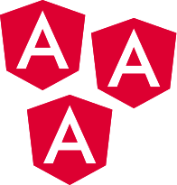

  

# Formação Angular

1. Explore as bases do Angular

   Mergulhando no universo do Angular, começando pela criação de aplicações usando a poderosa ferramenta Angular CLI.
   Aprendendo sobre estrutura de componentes e explorando os conceitos fundamentais, tais como templates, diretivas, services e injeção de dependências.
   Aprendendo como fazer a configuração de rotas da aplicação e aproveitando o poder do HTTPClient do Angular para executar operações CRUD no seu back-end.
   Além disso, vi construção de formulários e a aplicação de validações, utilizando as duas abordagens do angular - data driven (formulários reativos) e template driven - proporcionando uma base sólida para sua evolução.

   1. [Angular 14: aplique os conceitos e desenvolva seu primeiro CRUD](/memoteca)
      1. Router;
      2. ActivatedRoute;
      3. Services com HttpClient;
      4. Injeção de dependências de props;
      5. E algumas diretivas básicas do Angular.
   2. [Angular 14: evoluindo a aplicação](/memoteca)
      1. Formulários reativos com ReactiveFormsModule, FormGroup;
   3. [Formulários orientados a templates](/forms-angular-main/)

2. Gerencie o ciclo de vida de componentes e fluxo de dados reativos com a biblioteca RxJS

   Aperfeiçoe sua habilidade em controlar o comportamento dos componentes em várias fases de sua existência, desde a inicialização até a destruição, entendendo hooks do ciclo de vida como ngOnInit, ngOnChanges e ngOnDestroy.

   Aprofunde-se na utilização da biblioteca RxJS para programação reativa no Angular. Este passo detalha a criação de observables, a aplicação estratégica de operadores de transformação e combinação e a implementação de fluxos de dados assíncronos, proporcionando uma gestão eficiente de dados reativos em suas aplicações.

   1. [Angular: Ciclo de vida](/life-cycle-todo-app/)
   2. [Programação Reativa](https://www.youtube.com/watch?v=ifA-57jTk7Y)
   3. [RxJS e Angular: programando de forma reativa](/rxjs-projeto/)

3. Melhore a experiência do usuário com animações e interações atrativas no Angular(em andamento...)

#### TODO:
- [ ] Configurar um monorepo para esses projetos;