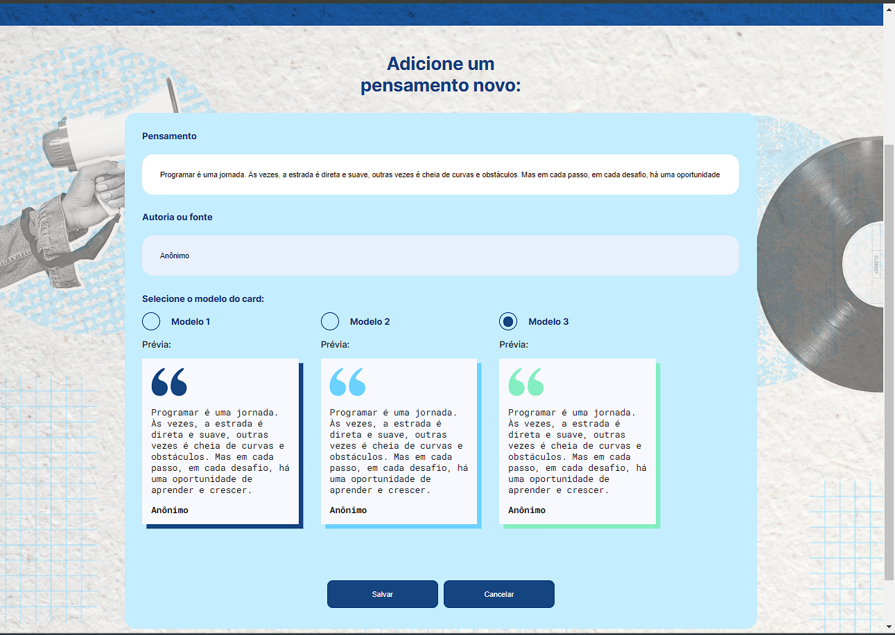
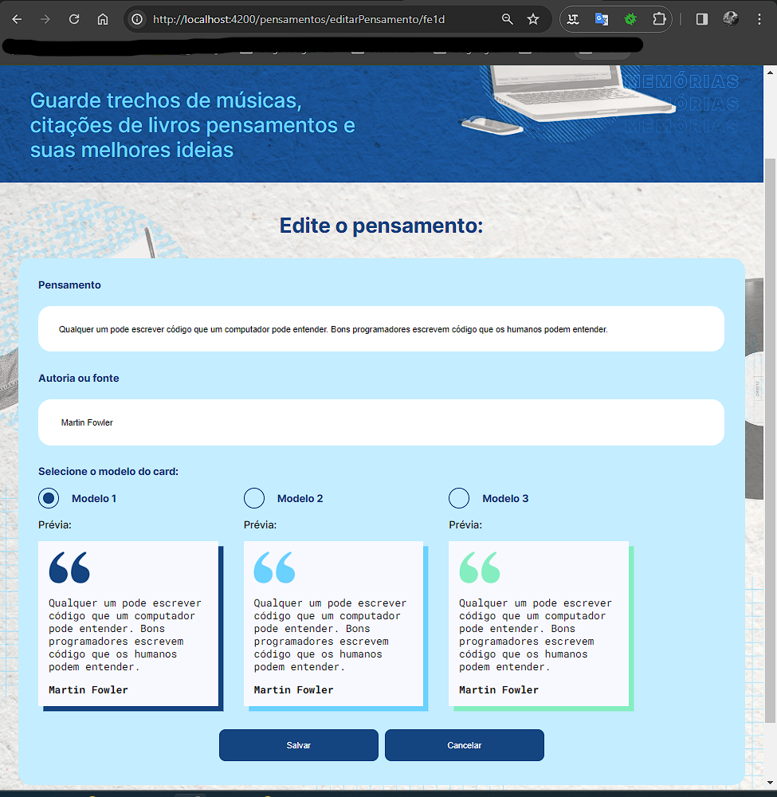

## Memoteca
> CRUDE simples para iniciar meu aprendizado no framework Angular.

- Este projeto foi gerando com o [Angular CLI](https://github.com/angular/angular-cli) version 14.0.0.
- Back-end fake com [json-server](https://github.com/typicode/json-server)

## Executando o projeto

- `npm install` instalando as dependências
- `npm serve` servidor back-end
- `npm start` servidor do Angular

## Telas
<figure>
  
  <figcaption>Listagem das citações</figcaption>
</figure>
<figure>
  
  <figcaption>Cadastro de uma citação</figcaption>
</figure>
<figure>
  
  <figcaption>Editando uma citação</figcaption>
</figure>