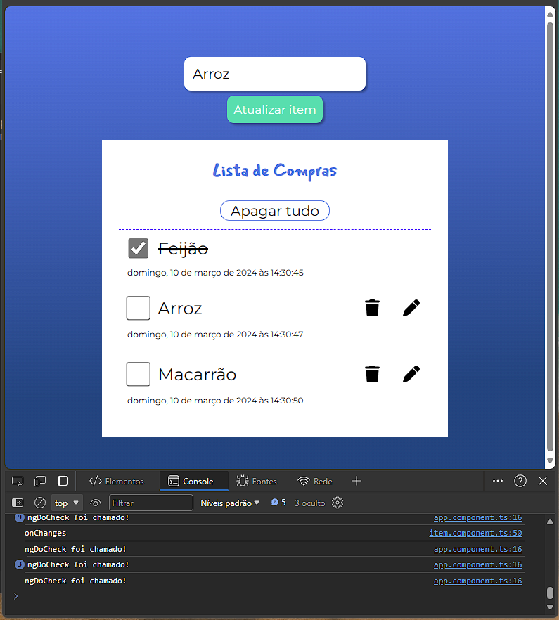

# Executando o projeto

This project was generated with [Angular CLI](https://github.com/angular/angular-cli) version 13.2.5.

## Requisitos

- Node;
- Angular

## Development server

Execute `npm start` para rodar o serve do Angular. Aplicação será iniciada em `http://localhost:4200/`.

## Code scaffolding

Execute `ng generate component component-name` para gerar um novo componente. Também pode utilizar `ng generate directive|pipe|service|class|guard|interface|enum|module`.

Anotações 

# Programação reativa
A programação reativa é um termo bastante conhecido que não está necessariamente vinculado ao um framework front-end (que é o caso do Angular).
Ela pode ser utilizada tanto no Fron-end quanto no Back-End, a pesar de ser um termo polêmico e possuir várias definições podemos dizer que é uma paradigma
de programação ou modelo de arquitetura que se refere à manipulação de fluxo de dados (strems) ou eventos de forma assíncrona. Ou seja, se existe assincronismo existe programação reativa por trás.
Existe um padrão de mercado muito popular que é o [ReactiveX](https://reactivex.io/).

O padrão Observer é a base da programação reativa. Algumas literaturas nomeia esse padrão de Pub/Sub  (Publish/Subscribe)

## RxJS
RxJS é uma biblioteca que utiliza o modelo ReactiveX no JavaScript/TypeScript, essa lib é amplamente utilizada em Framworks Front-end como o Angular, por exemplo.

## Observable
Coleção de valores ou uma coleção de eventos futuros.

## Observer
Ideia de uma coleção de callback, consegue ouvir os valores entregues, mas para isso precisa se escrever nos Observables.

## Telas

