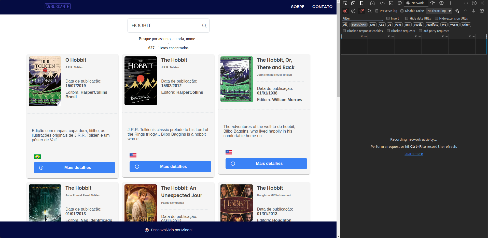
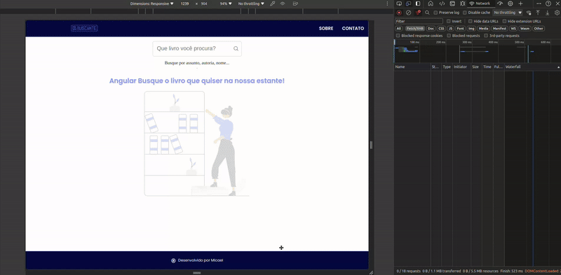

# 📚 RxJS Buscador de Livos

Aplicação que utliza a [API pública do Google](https://developers.google.com/books) busca de livros.


## Telas



## Executando o projeto

This project was generated with [Angular CLI](https://github.com/angular/angular-cli) version 13.2.5.

## Requisitos

- Node;
- Angular

## Development server

Execute `npm start` para rodar o serve do Angular. Aplicação será iniciada em `http://localhost:4200/`.

## Code scaffolding

Execute `ng generate component component-name` para gerar um novo componente. Também pode utilizar `ng generate directive|pipe|service|class|guard|interface|enum|module`.

<details>
<summary>Anotações </summary>

# Programação reativa

A programação reativa é um termo bastante conhecido que não está necessariamente vinculado ao um framework front-end (que é o caso do Angular).
Ela pode ser utilizada tanto no Fron-end quanto no Back-End, a pesar de ser um termo polêmico e possuir várias definições podemos dizer que é uma paradigma
de programação ou modelo de arquitetura que se refere à manipulação de fluxo de dados (strems) ou eventos de forma assíncrona. Ou seja, se existe assincronismo existe programação reativa por trás.
Existe um padrão de mercado muito popular que é o [ReactiveX](https://reactivex.io/).

O padrão Observer é a base da programação reativa. Algumas literaturas nomeia esse padrão de Pub/Sub (Publish/Subscribe)

## RxJS

RxJS é uma biblioteca que utiliza o modelo ReactiveX no JavaScript/TypeScript, essa lib é amplamente utilizada em Framworks Front-end como o Angular, por exemplo.

## Observable

Coleção de valores ou uma coleção de eventos futuros.

## Observer

Ideia de uma coleção de callback, consegue ouvir os valores entregues, mas para isso precisa se escrever nos Observables.

## Subscribre e Unsubscribe

```Typescript
	.subscribe({
				next: retornoAPI => console.log(retornoAPI),
				error: error => console.error(error), // Encerra o ciclo de vida do Observlable (complete não será chamado, coso exista o error)
				complete: () => console.log('Observable completado!'),
	});
```

O `subscribe` retorna um objeto do tipo `Subscription`que pode ser utilizado para desinscrição e liberação de recuros evitando _memory leak_

## Operadores RxJS

`Pipe`- Função que serve para agrupar múltiplos operadores. Não modifica o observable anterior.

`Tap` - Operador de serviços públicos. Usado para debugging. Não modifica o observable.

`Map` - Operador de transformação. Transforma o observable de acordo com a função passada. Retorna um observable modificado.

## Pipes Angular

Os pipes são formas de transformar valores. Por exemplo, para utilizar o pipe usamos o operado `|` em nosso template.
No exemplo logo a baixo mostramos uma data formatada por meio do pipe `date`.
`<p class="resultado">{{ livro.publishedDate | date: 'dd/MM/yyyy' }}</p>`
Há diversos outros pipes prontos que podem ser consultado na doc do Angular.
Mas também podemos criar nossos próprios pipes!

### Criando nosso pipes

A seguir estamos criando um pipe que dado uma listra de autores de determinado exemplar, será retornado apenas o primeiro autor.

```Typescript
// Criando o pipe autoria
import { Pipe, PipeTransform } from '@angular/core';

@Pipe({
	name: 'autoria',
})
export class AutoriaPipe implements PipeTransform {
	transform(autoria: string[]): string {
		if (autoria) {
			return autoria[0];
		}
		return '';
	}
}
```

```HTML
<!-- Utilizando pipe autoria-->
<p class="resultado">{{ livro.authors | autoria }}</p>

```

Além disso podemos encadiar pipes, exemplo: `<p class="resultado">{{ livro.authors | autoria | slice: 0 : 2 }}</p>` estamos limitando o nome do autor apenas a dois char.

### Pipe `async`

Há uma maneira muito popular de utilizar o observable no template do seu componente (view). Podemos fazer isso com pipe `async`. Veja um exemplo:
Compoenente:

```TypeScript
livrosEncontrados$ = this.campoBusca.valueChanges.pipe(
		debounceTime(DELAY_BUSCA),
		filter((valorDigital: string) => valorDigital.length >= TAMANHO_MIN_BUSCA), // filtrando para buscar apenas com 3 ou mais char
		distinctUntilChanged(),
		switchMap(valorDigitado => this.serviceGoogleAPIBook.buscar(valorDigitado)),
		tap(resp => console.log(resp)),
		map(items => items && this.parseToLivros(items))
	);
```

View, note como estamos nos referindo o observable `livrosEncontrados$` criado no controller:

```HTML
		<div
		class="container-card"
		*ngIf="livrosEncontrados$ | async as listaLivros; else telaInicial">
		<div *ngFor="let livro of listaLivros">
			<app-livro [livro]="livro"></app-livro>
		</div>
	</div>
```

- O pipe async é utilizado no angular para facilitar o uso de observables na aplicação;
- Utilizando essa abordagem do lado da view, o próprio Angular será capaz de se inscrever e de desinscrever do observable;
- Além disso estamos criando uma variável listaLivros no próprio template;
- O pipe async se inscreve em um Observable e retorna o último valor que emitiu. Quando um novo valor é emitido, o pipe async marca o componente a ser verificado quanto a alterações.

## Operadores RX

Há diversos operadores RxJS que podemos utilizar, a baixo está alguns dos operadores que são bastante utilizados.

- `map`-> Muito semelhante ao map que já conhecemos no JS da programação funcional do

  > Aplica uma determinada função a cada valor emitido pelo Observável de origem e emite os valores resultantes como um Observável.

- `tap` -> Para finalidade de Debug, ou seja, para depurar o fluxo do observável.
  > Não altera os dados.
- `switchMap` -> Utilizado para pegar o último valor emitido, Exemplo: vários clicks (recupera só último). A ideia desse operador é trocar os valores e passar ao servidor **só o último valor**: A -> B -> C -> D (apenas o D será o valor passado), `D`. Desconsidera os valores anteriores `A,B,C`
  > Projeta cada valor de origem em um Observável que é mesclado no Observável de saída, emitindo valores apenas do Observável projetado mais recentemente.
- `distinctUntilChanged`

  > Retorna um resultado Observável que emite todos os valores enviados pelo observável de origem se eles forem distintos em comparação com o último valor que o resultado observável emitiu.

- `filter` -> Mesma lógica do `filter` do Javascript/Typescript

  > Filtre os itens emitidos pela fonte Observável emitindo apenas aqueles que satisfazem um predicado especificado.

- `debounceTime`

  > Emite uma notificação da fonte Observável somente após um determinado intervalo de tempo ter passado sem outra emissão de fonte.

- `catchError` -> para lidar com erros no fluxo dos observables

  > Com o operador catchError, é possível capturar o erro que ocorreu, inserir uma lógica adicional para mostrar uma mensagem de erro para a pessoa usuária, por exemplo, e, utilizando o throwError, é possível retornar um novo observable.

### Busca type ahead

Imagine que você deseje implementar uma busca **type ahead**, ou seja, igual acontece com os motores de busca, enquanto você digita a busca será realizada.

Aqui precisamos considerar algumas coisa:

1. Só podemos realizar a busca quando o usuário digitar uma quantidade significativa de caracteres, digamos que `[chars...] >= 3`, caso contrário a busca fica muito genérica;

2. Não devemos realizar a mesma busca duas vezes. Exemplo: suponha que usuário digitou 'banana' -> (REQUEST) a busca foi feita -> depois vocÊ apagou o último 'a' -> depois digitou o 'a' novamente, ou seja, nossa palavra continua sendo 'banana'!. Mas os dados já foram buscados, logo não precisamos uma segunda request.;

3. Precisamos de um _delay_ para acompanhar o ritmo de digitação do usuários;

4. Assim que os dados forem retornados, iremos transformá-lo;

5. Também precisamos de um log do nosso fluxo;

6. Não queremos que toda letra que usuário digite seja feita uma REQUEST;

7. Tratar erros quando não for possível realizar a busca.

Veja o exemplo da busca abaixo, onde cada linha comentada satisfaz os intens que mencionamos anteriormente:

```typescript
// Conjunto de operadores para uma busca type ahead
livrosEncontrados$ = this.campoBusca.valueChanges.pipe(
	debounceTime(DELAY_BUSCA), // constante para o Delay (item 3)
	filter((valorDigital: string) => valorDigital.length >= TAMANHO_MIN_BUSCA), // evitando busca genéricas (item 1)
	distinctUntilChanged(), // evitando busca repetidas (item 2)
	switchMap(valorDigitado => this.serviceGoogleAPIBook.buscar(valorDigitado)), // realiza request panas para o último item digitado (item 6)
	tap(resp => console.log(resp)), // Depurando o fluxo (item 5)
	map(items => items && this.parseToLivros(items)), // Aplicando um transformação nos dados retornado(item 4)
	catchError(() => {
		// Trata o erro caso ocorra algum erro, exemplo sem internet. (item 7)
		this.mensagemErro = 'Ops, ocorreu um erro. Recarregue a aplicação!';
		return EMPTY; // callback de inscrição para quando não queremos utilizar o error.
	})
);
```

Nota: A ordem dos operadores agrupados dentro do `pipe(...)` IMPORTA!

</details>

## TODO (Adicional para praticar...):
- [X] Configurar lint;
- [X] Tornar a aplicação responsiva com [PrimeFlex](https://primeflex.org/).
- [X] Ajustar compoentes para o [PrimeNG](https://primeng.org/);
- [ ] Ajustar compoentes para o [PrimeNG](https://primeng.org/);
- [ ] Implementar paginação Google API;